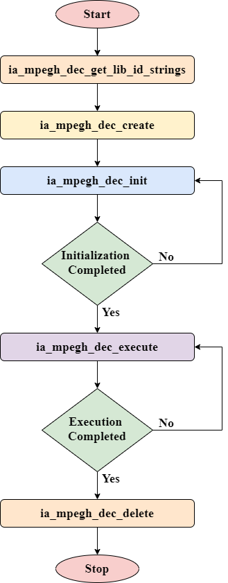

# Introduction of the MPEG-H 3D Audio Low Complexity Profile Decoder


The advent of object-based audio and scene-based audio has revolutionized the 
3D sound experience. 
Traditional channel-based coding expects the capture and playback geometric 
locations to be exactly the same for best reconstruction of the audio scene. 
On the other hand, object-based audio coding represents discrete sound sources 
in the audio scene. The positional information of each of the objects in the 
audio scene is conveyed in the form of metadata. 
Scene-based audio coding attempts to reconstruct the sound field at the playback
end using the coded higher order ambisonics (HOA) information. In case of both 
object-based and scene-based audio, the rendering algorithm can adapt based on 
the configuration of the playback end loudspeaker arrangement, thus making the 
sound experience agnostic to the configuration of speakers at the playback end.

MPEG-H 3D Audio is a coding standard that supports traditional channel-based, 
object-based and scene-based audio coding. 
The immersive 3D sound experience created by MPEG-H 3D Audio is significantly enhanced in
comparison with the traditional channel-based multichannel programs and playback
systems.

The MPEG-H 3D Audio Low Complexity Profile decoder supports all specified formats, 
including channel-based audio, object-based audio and scene-based audio via higher 
order ambisonics (HOA). State-of-the-art MPEG-H 3D Audio Low Complexity Profile decoders according 
to [ISO/IEC 23008-3:2019/AMD 2:2020](https://www.iso.org/standard/79147.html) also support the MPEG-H 3D Audio Baseline Profile, which is a 
subset of the MPEG-H 3D Audio Low Complexity Profile. The MPEG-H 3D Audio Baseline 
Profile does not support scene-based audio/HOA.

# Introduction to MPEG-H 3D Audio Low Complexity Profile Decoder APIs

## Files to be included are
* [`impeghd_api.h`](decoder/impeghd_api.h)
* [`impeghd_type_def.h`](decoder/impeghd_type_def.h)
* [`impeghd_memory_standards.h`](decoder/impeghd_memory_standards.h)
* [`impeghd_error_codes.h`](decoder/impeghd_error_codes.h)
* [`impeghd_config_params.h`](decoder/impeghd_config_params.h)

## Decoder APIs

| **API Call** | **Description** |
|------|------|
|ia_mpegh_dec_get_lib_id_strings | Gets the decoder library name and version number details |
|ia_mpegh_dec_create | Gets the memory requirements size and allocate required memory |
|ia_mpegh_dec_init | Decodes the header/initialization bytes |
|ia_mpegh_dec_execute | Decodes the input frame data |
|ia_mpegh_dec_delete | Frees the allocated memories for the decoder |

## Flowchart of calling sequence



#  Building the MPEG-H 3D Audio Low Complexity Profile Decoder

## Building for Unix/MacOS
* Makefiles for building the MPEG-H 3D Audio Low Complexity Profile decoder library and application are provided in `build/makefile` folder.
* These makefiles are common for Unix/MacOS builds.
* If compiling for non-native platforms, ensure that the compiler and sysroot are updated.   
* Supported `arch` values are `x86`, `x86_64`, `armv7` and `armv8`.
* Build the library followed by the application using the below commands:
```
$ make -f Makefile_lib clean all ARCH=<arch>
$ make -f Makefile clean all	ARCH=<arch>
```

## Building for Windows
* MSVS projects files required for building the MPEG-H 3D Audio Low Complexity Profile decoder library and application are provided in `build/msvs` folder.
* These MSVS project files correspond to "MSVS 2017". If the MSVS version is different, then the SDK and toolset will have to be updated accordingly.

## Using CMake
Users can also use cmake to build for `x86`, `x86_64`, `armv7`, `armv8` and Windows (MSVS project) platforms.

### Building for native platforms
Run the following commands to build the MPEG-H 3D Audio Low Complexity Profile Decoder for native platform:
```
Go to the root directory(libmpegh/) of the MPEG-H 3D Audio Low Complexity Profile Decoder.
Create a new folder in the project root directory and move to the newly created folder.

$ cd <path to libmpegh>
$ mkdir bin
$ cd bin
$ cmake ..
$ cmake --build .
```

### Cross-compiling
Run the following commands to cross compile for `x86`, `ARMv7` or `ARMv8`:
```
Go to the root directory(libmpegh/) of the MPEG-H 3D Audio Low Complexity Profile Decoder.
Create a new folder in the project root directory and move to the newly created folder.

$ cd <path to libmpegh>
$ mkdir bin
$ cd bin
$ cmake .. -DCMAKE_TOOLCHAIN_FILE=../toolchain_<arch>.cmake
$ cmake --build .
```

### Creating MSVS project files
To create MSVS project files for the MPEG-H 3D Audio Low Complexity Profile decoder from cmake, run the following commands:
```
Go to the root directory(libmpegh/) of the MPEG-H 3D Audio Low Complexity Profile Decoder.
Create a new folder in the project root directory and move to the newly created folder.

$ cd <path to libmpegh>
$ mkdir bin
$ cd bin
$ cmake -G "Visual Studio 15 2017" ..
```

The above command creates MSVS 2017 project files. If the version is different, modify the generator name accordingly.
The MPEG-H 3D Audio Low Complexity Profile decoder can be built using these project files.

## Using Autoconf
Run the following commands to build using autoconf tools:
```
Go to the root directory(libmpegh/) of the MPEG-H 3D Audio Low Complexity Profile Decoder.

$ cd <path to libmpegh>
$ autoreconf -if
$ ./configure
$ make 
```

# Running the MPEG-H 3D Audio Low Complexity Profile Decoder

The MPEG-H 3D Audio Low Complexity Profile Decoder can be run by providing command-line parameters(CLI options) directly or by providing a parameter file as a command line argument.

Command line usage : 
```
<exceutable> -ifile:<input_file> -ofile:<out_file> [options]

[options] can be,
[-pcmsz:<pcmwordsize>]
[-target_loudness:<target_loudness>]
[-effect:<drc_effect_type>]
[-cicp:<target_layout>]
[-ilsi:<lsi_file>]
[-isdi:<sd_file>]
[-iei:<ei_file>]
[-ibrir:<brir_file>]
[-out_fs:<output_samp_freq>]
[-ext_ren:<extrn_rend_flag>]

where,
  <inputfile>        is the input MPEGH file name.
  <outputfile>       is the output file name.
  <pcmwordsize>      is the bits per sample info.
  <target_loudness>  is target loudness in dB.
  <drc_effect_type>  is drc effect type.
  <target_layout>    is target speaker layout.
  <lsi_file>         bitstream file with local setup information.
  <sd_file>          bitstream file with scene displacement information.
  <ei_file>          bitstream file with element interaction information.
  <brir_file>        bitstream file with binaural renderer impulse response data.
  <output_samp_freq> desired sampling frequency of the output stream -
                     invokes resampler if needed.
  <extrn_rend_flag>  flag to enable external rendering interfaces creation.
                     Enabling this flag creates external rendering interface
                     bitstreams in the same location as decoder executable
```					 
					 
Sample CLI:
```
<mpegh_dec_exe> -ifile:in_file.mhas -ofile:out_file.wav -pcmsz:16 					 
```

**Using paramfile :**

The same CLI options can be provided to the MPEG-H 3D Audio Low Complexity Profile decoder via a parameter file.

Parameter file can be used to run multiple files in a single decoder instance.

Default parameter file name: `paramfilesimple.txt` 

Apart from the facility to invoke command line options, there are certain special options available that can be set in the parameter file. 

Below is the list of all such parameters:

```
@Input_path  <Path to Input streams location>
@Output_path <Path to write output PCM/WAVs location>
@Start
<CLI options>
@Stop
```

Any CLI can be invoked only after `@Start`.

`@Stop` indicates end of CLI option processing.

Any CLI mentioned after `@Stop` will not be processed. 

In case there are multiple `@Start` and `@Stop`, only the options between the first `@Start` and `@Stop` will be processed.

A sample [`paramfilesimple.txt`](build/msvs/paramfilesimple.txt) can be found in `build/msvs` folder.

The Parameter file can be given as an argument to the application with the path specified.

The input and the output paths in parameter file should either be relative to the executable path or the absolute paths.

If no argument is given, by default the application reads the test vectors names from the parameter file located in the same directory as executable, with the name as paramfilesimple.txt.

Sample Usage:
```
<mpegh_dec_exe> -paramfile:paramfilesimple.txt
```

For more details, refer to Section 3.1 of [`IA-MPEG-H-3D-Audio-Dec-GSG.doc`](docs/IA-MPEG-H-3D-Audio-Dec-GSG.doc)

# Smoke testing the MPEG-H 3D Audio Low Complexity Profile Decoder

A Sample test suite is provided in the workspace. The contents of the testsuite are described below.

* `smoke_test_suite/inp/` - Contains `.mhas` and `.mp4` sample streams.
                          The decoded output of a pair of `.mhas` and `.mp4` files will be bit-identical.
* `smoke_test_suite/ref/` - Contains decoded output in wav format for reference.
* `smoke_test_suite/run_smoke.py` - Sample python script that runs the smoke test suite. This script uses executable with path as an argument.
   						  
   Example : python run_smoke.py ./<exe_name>

# Validating the MPEG-H 3D Audio Low Complexity Profile Decoder

The MPEG-H 3D Audio Low Complexity Profile decoder has been tested with all the conformance streams as specified by [ISO/IEC 23008-9](https://www.iso.org/standard/71974.html)

# Building the Documentation of the MPEG-H 3D Audio Low Complexity Profile Decoder

Documentation can be generated with the doxygen utility for the MPEG-H 3D Audio Low Complexity Profile Decoder.
Follow the below commands to generate the documentation.

```
$ cd docs
$ doxygen doxy.conf
```

Documentation will be generated in `docs/documentation` folder.
Browse through the documentation from `index.html` located in `docs/documentation/html` folder.

# Additional Documents

Brief description about documents present in  `docs` folder

* [`IA-MPEG-H-3D-Audio-Dec-API.doc`](docs/IA-MPEG-H-3D-Audio-Dec-API.doc) - Describes Application Program Interface for the MPEG-H 3D Audio Low Complexity Profile Decoder.
* [`IA-MPEG-H-3D-Audio-Dec-BP.doc`](docs/IA-MPEG-H-3D-Audio-Dec-BP.doc) - Describes the build procedure for the MPEG-H 3D Audio Low Complexity Profile Decoder on Unix/MacOS platforms. 
* [`IA-MPEG-H-3D-Audio-Dec-DS.doc`](docs/IA-MPEG-H-3D-Audio-Dec-DS.doc) - Describes features supported by the MPEG-H 3D Audio Low Complexity Profile Decoder, memory requirements and computational complexity on `x86`, `x86_64`, `armv7` and `armv8` platforms.
* [`IA-MPEG-H-3D-Audio-Dec-GSG.doc`](docs/IA-MPEG-H-3D-Audio-Dec-GSG.doc) - Getting Started Guide for the MPEG-H 3D Audio Low Complexity Profile Decoder.
* [`IA-MPEG-H-3D-Audio-Dec-TR.doc`](docs/IA-MPEG-H-3D-Audio-Dec-TR.doc) - Documents the conformance test report for the MPEG-H 3D Audio Low Complexity Profile decoder on `x86`, `x86_64`, `armv7` and `armv8` platforms.

### Guidelines working with GitHub

Please refer to the [guildelines](GUIDELINES.md) for the following processes
- Reporting issues
- Creating Pull Request
- Commit message standards
